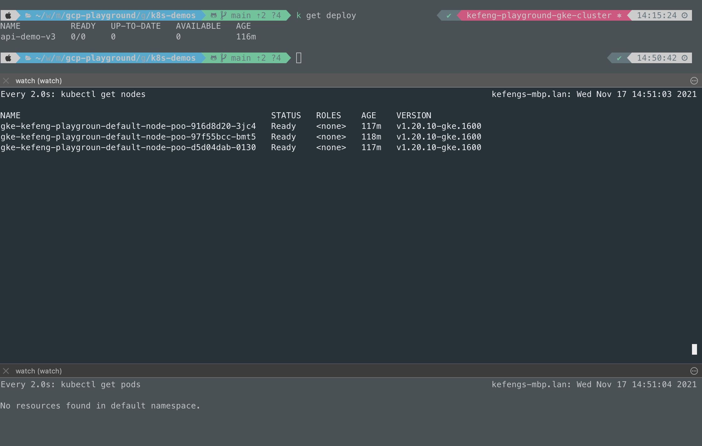
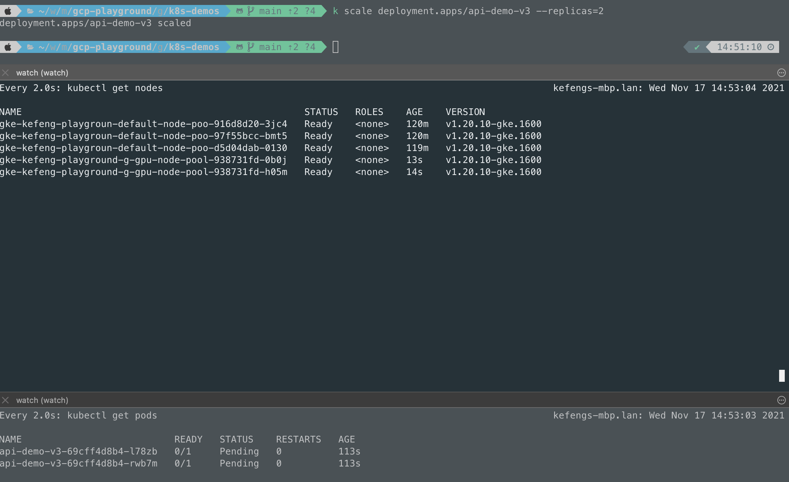
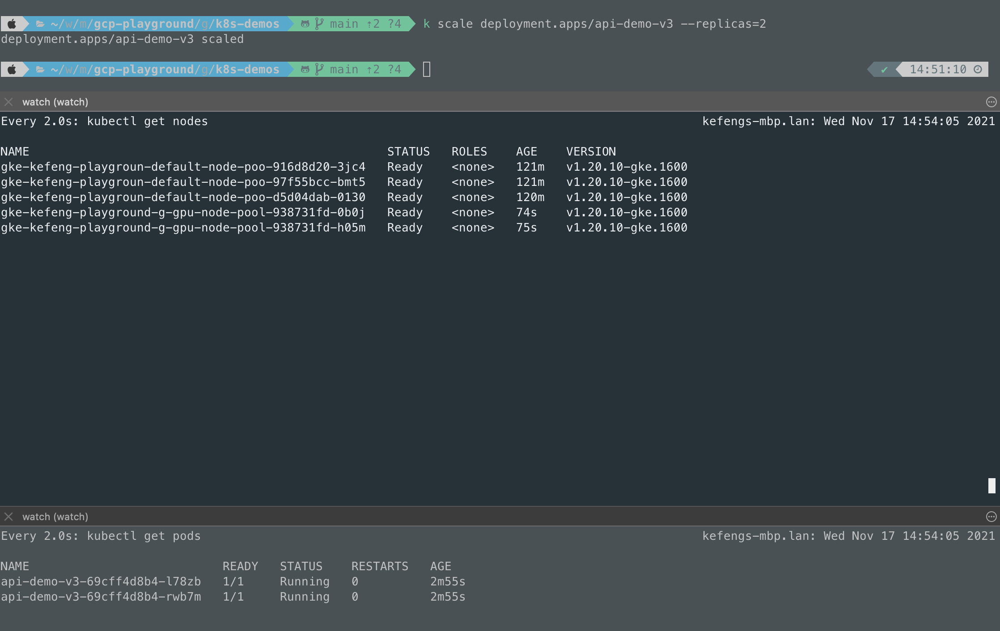
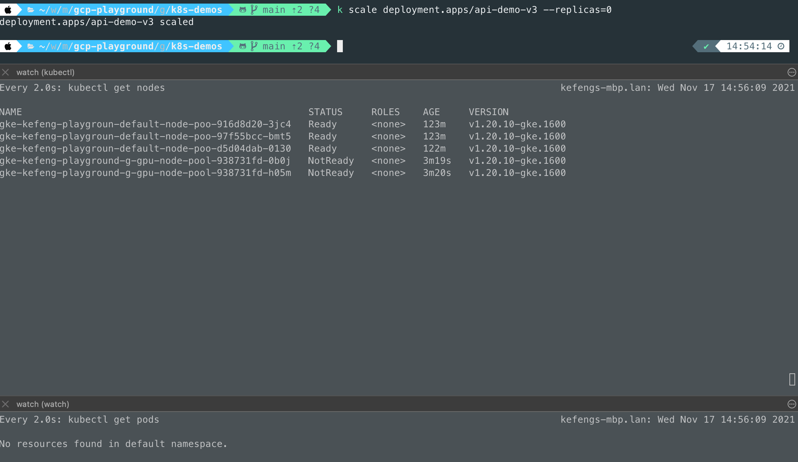
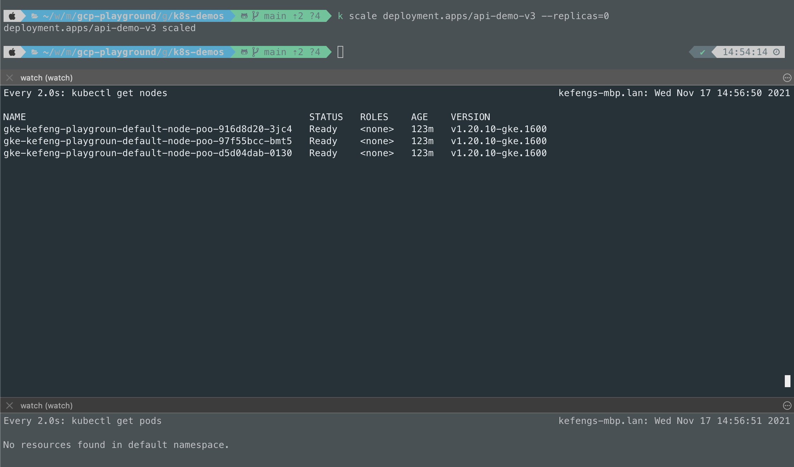

# GKE node autoscheduler POC

This repository contains a minimal POC implementation for demonstrating a node-pool scaling scheduler by using GKE node auto-provisioning and kubernetes cron jobs.

## Overview

This POC will scale down the node pool size to ZERO at 5pm (NZST), and bring it back to a normal state (2 nodes) at 8am (NZST) with GPU acceleator. The goal of this solutions is for saving the cost by turning down the GPU nodes after hours.

It also can be implemented by using scaling-schedules [1], but this solution is more kubernetes-friendly.

### Node auto-provisioning

Node auto-provisioning is a GKE feature to be able to provisioning nodes or managing node pools automatically, and auto-scale the nodes to meet the resource requirements based on workloads [2].

### Kubernetes Cron Job

A cronjob is a kubernetes-managed schedule to run a job repeatly based on a Cron format string [3][4].

## Prerequisite

* Terragrunt (v0.35.10 and above)
* kubectl

## How to run and evaluate

### Create a new GKE cluster

```bash

cd ./terragrunt-src/non-prod/dev

terragrunt run-all apply

```
This script will do following things:

* create a new GKE cluster without default node pool
* create a new default node pool with 3 nodes
* create a GPU node pool with _nvidia-tesla-p4_ accelerator in zone _australia-southeast1-b_
  * the minimul node size is ZERO
  * the maximal node size is 5 nodes

### Deploy a demo application

```bash

cd ./app-demo

kubectl apply -f deployment.yaml

```

This script will create a deployment in cluster with ZERO replica by default.

### Deploy CronJob

```bash

cd ./cronjob

kubectl apply -f cron-job.yaml

```

This script will do:

* create a new service account with _cluster-admin_ permission
* create two cron jobs
  * job _gpu-service-up-cronjob_ scales up the deployment to 2 replicas
  * job _gpu-service-down-cronjob_ scales down the deployment to ZERO replica

### Evaluate

You can manually scale up and down the replica size of application, which will trigger
node auto-provisioning feature to provisioning the new node, or remove them from
the pool.

```bash

# scale up
kubectl scale deployment.apps/api-demo-v3 --replicas=2

# scale down
kubectl scale deployment.apps/api-demo-v3 --replicas=0

```

## Screenshots

1. Before scale up



2. During scale up



3. After scale up



4. Before scale down


5. During scale down



6. After scale dow



## Limitations

1. There is no Google Cloud region has GPUs in all zones. So, we have to initialise node-pool for a single zone with supported accelerator type.
https://cloud.google.com/kubernetes-engine/docs/how-to/gpus#gpu_regional_cluster

2. In order to enable auto-provisioning with GPUs, we need to install NVIDIA's device drivers to the node.
https://cloud.google.com/kubernetes-engine/docs/how-to/gpus#installing_drivers

3. `CRON_TZ=<timezone>` prefix is not available yet until version 1.22. Currently, the latest GKE version is 1.21.5.
* https://kubernetes.io/docs/concepts/workloads/controllers/cron-jobs/#cron-schedule-syntax
* https://stackoverflow.com/questions/68950893/how-can-i-specify-cron-timezone-in-k8s-cron-job

So, you have to use UTC timezone in current GKE version.

## References

1. https://cloud.google.com/compute/docs/autoscaler/scaling-schedules
2. https://cloud.google.com/kubernetes-engine/docs/how-to/node-auto-provisioning
3. https://kubernetes.io/docs/concepts/workloads/controllers/cron-jobs/
4. https://en.wikipedia.org/wiki/Cron

## License
See the [License File](./LICENSE).
